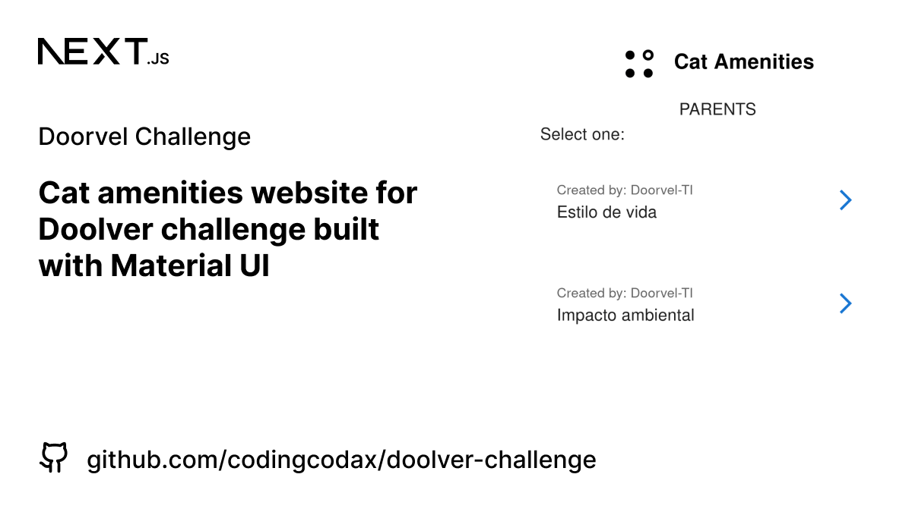

  

  <h3 align='center'>Amenities | Doorvel Challenge</h3>

  

    <samp>Cat amenities website for Doolver challenge built with Material UI.</samp>
  

## Features

- Use static site generation and sever side rendering.
- Responsive
- Seo
- Typesafe

### Roadmap

- [x] Filter amenities childs
- [x] Add dark theme
- [ ] Add card skeleton when loading
- [ ] Add `save to favorites` (authentication needed? or local storage) (state management?)
- [ ] Add images to amenities childs with unsplash (masonry?) but first:
- [ ] Translate `name` text with an API for unsplash
- [ ] Generate og image for `amenities childs` dynamically

### Techstack

This app was built with the T3 Stack:

- [Next.js](https://nextjs.org)
- [Zod](https://zod.dev/)
- [Material UI](https://mui.com)
- [TypeScript](https://typescriptlang.org)

## License

Licensed under the [MIT license](./LICENSE.md)
